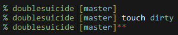

# DoubleSuicide fish prompt

## Custom prompt for [fish](https://fishshell.com), inspired by [robbyrussell](https://github.com/oh-my-fish/theme-robbyrussell)
* Clean
* Lean
* Fast
* Minimal

## Screenshots

## Requirements
* fish >= `2.7.1`
* git >= `2.10.0`

## Installation
* To install: `make install`
* To uninstall: `make uninstall`

You may have to exit and re-launch fish after these commands if it is already running.
